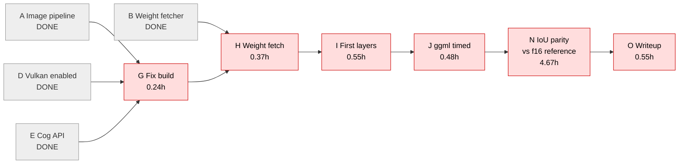
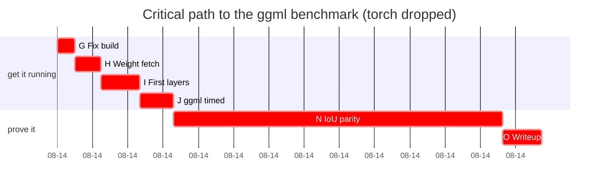

# PERT: getting the ggml benchmark on RunPod

> **Revised 2026-08-14.** The torch comparison was dropped and
> `interactor-seethrough-torch` archived. Tasks K/L/M are struck from the
> model. Consequence: the ggml chain, which had 1.81 h of slack, **is now the
> critical path**, and N changes meaning -- parity is measured against the
> f16 reference PSD (the convention this repo already uses) rather than
> against a second implementation.
>
> Revised critical path: **G -> H -> I -> J -> N -> O = 6.86 h**.
> Long pole is still N (4.67 h), which still does not exist.

Three-point estimates in hours, `E = (O + 4M + P) / 6`. Tasks already
completed carry `E = 0.0 (DONE)` so they drop out of the remaining schedule.

## Tasks

| ID | Task | Pred | O | M | P | E |
|----|------|------|---|---|---|---|
| A | Image build pipeline (Dockerfile, CI, GHCR) | — | — | — | — | 0.0 (DONE) |
| B | Weight fetcher, asset resolution verified | A | — | — | — | 0.0 (DONE) |
| C | Log retrieval without console (OTel endpoint) | A | — | — | — | 0.0 (DONE) |
| D | Vulkan enablement (X11 + GLVND + caps=all) | C | — | — | — | 0.0 (DONE) |
| E | Cog wire API, local smoke test | A | — | — | — | 0.0 (DONE) |
| F | torch image builds, cu128 deps resolve | — | — | — | — | 0.0 (DONE) |
| G | Port-collision fix build publishes | D,E | 0.15 | 0.2 | 0.5 | 0.24 |
| H | Serve-mode run: 10.7GB weight fetch completes | B,G | 0.2 | 0.3 | 0.8 | 0.37 |
| I | First prediction returns per-layer PNGs | H | 0.2 | 0.4 | 1.5 | 0.55 |
| J | ggml timed benchmark run | I | 0.3 | 0.4 | 1.0 | 0.48 |
| ~~K~~ | ~~torch entrypoint verified on GPU~~ | — | — | — | — | dropped |
| ~~L~~ | ~~torch VRAM footprint~~ | — | — | — | — | dropped |
| ~~M~~ | ~~torch timed benchmark~~ | — | — | — | — | dropped |
| N | IoU parity harness vs f16 reference (>= 0.99/layer) | J | 2.0 | 4.0 | 10.0 | **4.67** |
| O | Comparison writeup + logbook + ADR | N | 0.3 | 0.5 | 1.0 | 0.55 |

## Forward pass

| ID | ES | EF |
|----|----|----|
| G | 0.00 | 0.24 |
| H | 0.24 | 0.61 |
| I | 0.61 | 1.16 |
| J | 1.16 | **1.64** |
| N | 1.64 | 6.31 |
| O | 6.31 | **6.86** |

## Critical path

**G → H → I → J → N → O = 6.86 h** (revised, torch dropped)

Every remaining task is on the critical path -- with the torch branch gone
there is no parallel work left to hold slack. The long pole is **N**
(4.67 h, 68% of the remaining schedule) and it still does not exist.

The original path was K → L → M → N → O = 8.67 h; dropping torch removed
1.81 h from the finish and eliminated the only source of slack.

## What this says

**N dominates at 4.67 h — 68% of what is left — and does not exist.** The
parity gate `docs/quantization-ladder.md` depends on has no harness. Without
it the ladder is a plan, not a result, and no quantization claim can be made.

**There is no slack left.** Dropping torch removed the only parallel branch,
so every remaining task delays the finish by its full duration. G→H→I→J is
cheap (1.64 h total) but now sits directly in front of the long pole.

What the earlier version got wrong is worth keeping visible: the ggml work
was originally *off* the critical path, and it only became critical because
the scope shrank around it. Effort spent there was not justified by the
schedule at the time -- it was justified after the fact by a decision that
had not been made yet.

The comparison N now performs is ggml-vs-its-own-f16-reference, not
ggml-vs-torch. That is a weaker claim: it can show quantization preserves
output, but it cannot show this implementation matches upstream. If a
cross-implementation number is ever wanted, the archived torch repo is the
starting point.
