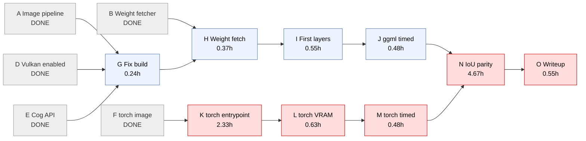
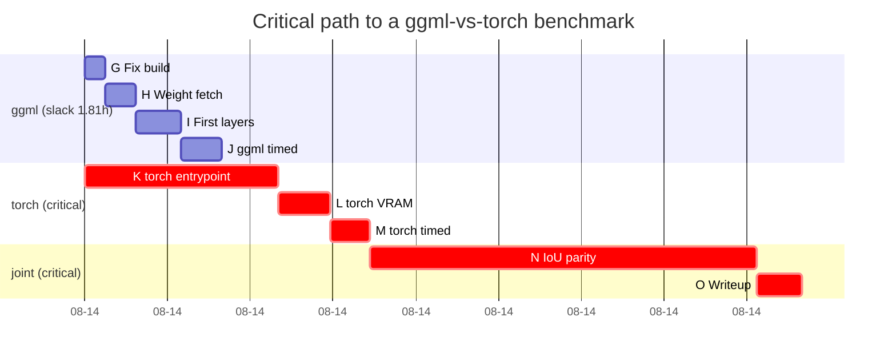

# PERT: getting a ggml-vs-torch benchmark on RunPod

Three-point estimates in hours, `E = (O + 4M + P) / 6`. Tasks already
completed carry `E = 0.0 (DONE)` so they drop out of the remaining schedule.

## Tasks

| ID | Task | Pred | O | M | P | E |
|----|------|------|---|---|---|---|
| A | Image build pipeline (Dockerfile, CI, GHCR) | — | — | — | — | 0.0 (DONE) |
| B | Weight fetcher, asset resolution verified | A | — | — | — | 0.0 (DONE) |
| C | Log retrieval without console (OTel endpoint) | A | — | — | — | 0.0 (DONE) |
| D | Vulkan enablement (X11 + GLVND + caps=all) | C | — | — | — | 0.0 (DONE) |
| E | Cog wire API, local smoke test | A | — | — | — | 0.0 (DONE) |
| F | torch image builds, cu128 deps resolve | — | — | — | — | 0.0 (DONE) |
| G | Port-collision fix build publishes | D,E | 0.15 | 0.2 | 0.5 | 0.24 |
| H | Serve-mode run: 10.7GB weight fetch completes | B,G | 0.2 | 0.3 | 0.8 | 0.37 |
| I | First prediction returns per-layer PNGs | H | 0.2 | 0.4 | 1.5 | 0.55 |
| J | ggml timed benchmark run | I | 0.3 | 0.4 | 1.0 | 0.48 |
| K | torch entrypoint + arg surface verified on GPU | F | 1.0 | 2.0 | 5.0 | **2.33** |
| L | torch pod run, VRAM footprint measured | K | 0.3 | 0.5 | 1.5 | 0.63 |
| M | torch timed benchmark run | L | 0.3 | 0.4 | 1.0 | 0.48 |
| N | IoU parity harness (>= 0.99 per layer) | J,M | 2.0 | 4.0 | 10.0 | **4.67** |
| O | Comparison writeup + logbook + ADR | N | 0.3 | 0.5 | 1.0 | 0.55 |

## Forward pass

| ID | ES | EF |
|----|----|----|
| G | 0.00 | 0.24 |
| H | 0.24 | 0.61 |
| I | 0.61 | 1.16 |
| J | 1.16 | **1.64** |
| K | 0.00 | 2.33 |
| L | 2.33 | 2.97 |
| M | 2.97 | **3.45** |
| N | 3.45 | 8.12 |
| O | 8.12 | 8.67 |

## Critical path

**K → L → M → N → O = 8.67 h**

The ggml chain (G→H→I→J) finishes at EF 1.64, well before N can start at
3.45. It has **1.81 h of slack** and is *off* the critical path.

Long poles: **N** (4.67 h) then **K** (2.33 h).

## What this says

Everything worked on so far tonight — Vulkan enablement, the log endpoint,
the Cog API, the port-collision fix — sits on the **slack** branch. It felt
like the blocker because it was where the failures were, but failures are not
the same as long poles.

**K is untouched and on the critical path.** The torch image builds and its
dependencies resolve, but `inference/scripts/inference_psd.py` has never been
invoked from it; its argument surface is unconfirmed and the ENTRYPOINT is an
assumption. That is the earliest undone critical-path task.

**N dominates at 4.67 h** and does not exist in any form. The parity gate that
`docs/quantization-ladder.md` depends on has no harness. It gates the only
output that matters — a defensible comparison — and cannot start until both
implementations produce layers.

Corollary: finishing the ggml chain sooner does not move the finish date at
all. It only stops being true if the ggml chain overruns its 1.81 h of slack.
