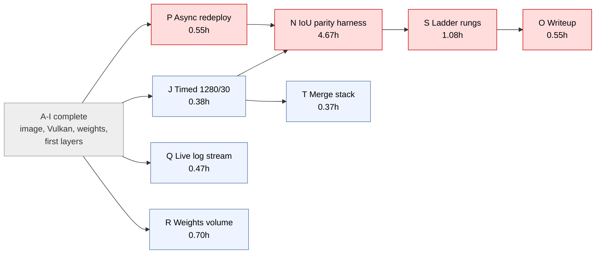
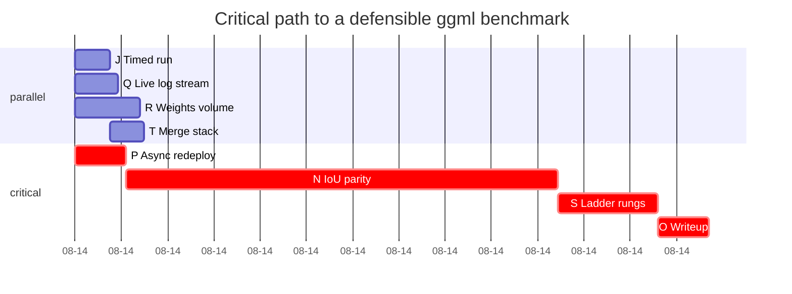

# PERT: getting the ggml benchmark on RunPod

Three-point estimates in hours, `E = (O + 4M + P) / 6`. Completed tasks carry
`E = 0.0 (DONE)` and drop out of the remaining schedule.

**Revision 2 (2026-08-14).** The torch comparison was dropped and
`interactor-seethrough-torch` archived, removing tasks K/L/M. G, H and I are
now complete: the image builds, Vulkan initialises on an A40 inside a
container, 14 GB of weights fetch from GitHub Releases, and a prediction
returns 30 per-layer PNGs plus a PSD over the Cog wire API. Three new tasks
(P, Q, R) came out of failures during those runs rather than from planning.

## Tasks

| ID | Task | Pred | O | M | P | E |
|----|------|------|---|---|---|---|
| A–F | Image pipeline, weight fetcher, log endpoint, Vulkan, Cog API | — | — | — | — | 0.0 (DONE) |
| G | Port-collision fix published | — | — | — | — | 0.0 (DONE) |
| H | 10.7 GB weight fetch completes on host | — | — | — | — | 0.0 (DONE) |
| I | Prediction returns per-layer PNGs (verified real) | — | — | — | — | 0.0 (DONE) |
| J | Timed 1280px/30-step benchmark captured | — | 0.1 | 0.3 | 1.0 | 0.38 |
| P | Async server rebuilt + redeployed | — | 0.3 | 0.5 | 1.0 | 0.55 |
| Q | Stream inference logs live (Popen, not capture-then-emit) | — | 0.2 | 0.4 | 1.0 | 0.47 |
| R | Persistent weights volume (avoid 14 GB refetch per deploy) | — | 0.3 | 0.6 | 1.5 | 0.70 |
| N | IoU parity harness vs f16 reference (>= 0.99/layer) | J,P | 2.0 | 4.0 | 10.0 | **4.67** |
| S | Quantization ladder rungs measured (q4 vs f16) | N | 0.5 | 1.0 | 2.0 | 1.08 |
| T | Merge stack PRs, drop temp-publish branch | J | 0.2 | 0.3 | 0.8 | 0.37 |
| O | Writeup: logbook entry + ADR | S | 0.3 | 0.5 | 1.0 | 0.55 |

## Forward pass

| ID | ES | EF | On path |
|----|----|----|---------|
| J | 0.00 | 0.38 | feeds N |
| P | 0.00 | **0.55** | **critical** |
| Q | 0.00 | 0.47 | no |
| R | 0.00 | 0.70 | no |
| N | 0.55 | 5.22 | **critical** |
| S | 5.22 | 6.30 | **critical** |
| T | 0.38 | 0.75 | no |
| O | 6.30 | **6.85** | **critical** |

## Critical path

**P → N → S → O = 6.85 h**

Long pole is **N** at 4.67 h — **68% of everything remaining** — and it does
not exist in any form.

## What this says

**N is the whole schedule.** At 4.67 h it is 68% of the remaining 6.85 h and
nothing about it has been started. Everything built so far — the image, the
Vulkan fixes, the Cog API, the log endpoint — is *plumbing to make N
possible*. The plumbing now works; the measurement does not exist.

**Speed was never the hard part.** The timing number (J) costs 0.38 h. The
defensibility of that number costs 4.67 h. Any version of this project that
reports a wall-clock figure without N is reporting an unvalidated number.

**Three tasks came out of failures, not planning.** P exists because RunPod's
proxy closes connections at ~100 s, so a synchronous 1280px run can never
return over the wire. Q exists because the log endpoint does not stream during
inference — `subprocess.run(capture_output=True)` buffers until exit, which
contradicts the reason the endpoint was built. R exists because every redeploy
refetches 14 GB. Only P gates N; Q and R are quality and speed.

**Q is off the critical path and still worth doing.** Being blind for the
duration of a 10-minute run is what turned J into guesswork about whether it
had hung.

## Superseded

Revision 1 modelled a ggml-vs-torch comparison with critical path
K → L → M → N → O = 8.67 h, where the ggml chain held 1.81 h of slack.
Dropping torch removed that branch. Worth keeping visible: the ggml work was
originally *off* the critical path and became critical only because the scope
shrank around it. Parity is now ggml-vs-its-own-f16-reference — it can show
quantization preserves output, but not that this implementation matches
upstream.
